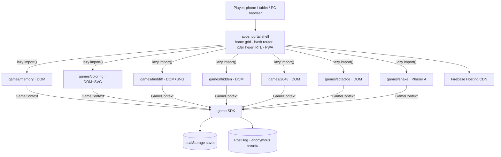

# Ellaz Architecture

Ellaz is a cross-device casual-games **PWA**: one website, many small games, playable
on phone, tablet, and PC with touch, mouse, or keyboard. Hebrew (default, RTL) +
English (LTR). Anonymous play, on-device saves, anonymous kid-safe analytics, no backend.

## System diagram



## Module layout

Single Vite app; internal modules mirror extractable packages 1:1 (imported via the
`@sdk` / `@ui` / `@juice` / `@i18n` aliases):

| Module | Responsibility |
|--------|----------------|
| `src/sdk` | The neutral **GameModule / GameContext** contract every game implements: `SaveStore` (localStorage), analytics port (PostHog behind an interface), audio port, lifecycle, ads stubs |
| `src/ui` | Design tokens + RTL-aware components (Hebrew-first fonts, big touch targets) |
| `src/juice` | Game-feel kit — haptics, screen shake, particle burst, tween |
| `src/i18n` | he (RTL) + en (LTR) strings + direction |
| `src/portal` | Shell: `App` (hash router), `Home` (grid), `GameHost` (mount/unmount bridge), `catalog` (registry + lazy loaders) |
| `src/games/<id>` | `logic.ts` (pure, TDD) + `logic.test.ts` + a DOM (React) or canvas (Phaser) renderer |

## The SDK contract

Games never touch portal internals — only `GameContext`. Its lifecycle + ads shape
matches the **Poki + CrazyGames** union, so games can list on those portals later
with no rewrites.

```ts
interface GameModule {
  meta: { id; title: {he,en}; emoji; color; ageBand: "kids"|"all";
          category: "kids"|"classics"; orientation; renderer: "dom"|"phaser" };
  mount(ctx: GameContext): Promise<void>;
  unmount(): void;
}
interface GameContext {
  mount: HTMLElement; locale; dir; t;
  storage: SaveStore;                 // gameId-scoped, incognito-safe
  analytics: AnalyticsPort;           // anonymous, kid-safe (never identify())
  audio: AudioPort;                   // WebAudio synth; unlock() on first gesture
  lifecycle: { loadingStart/Finished; gameplayStart/Stop };
  ads: { interstitial(); rewarded() };// no-op stubs in v1
  onRequestExit; onPause; onResume; onResize;
}
```

## Rendering split

- **React DOM** — board/card/grid/word games (memory, coloring, finddiff, hidden,
  2048, tictactoe). Free accessibility, text, responsive layout, trivial input.
- **Phaser 4** — action/canvas games (snake, and future arcade). Phaser lives in a
  **shared vendor chunk** (`vite.config` `manualChunks`) downloaded once and cached
  across all canvas games.

Each game is lazy-loaded via `import()` so only the code you play is downloaded.

## Cross-device rules

- **Input:** Pointer Events only (`pointerdown/move/up` + `setPointerCapture`);
  `touch-action: none` on play surfaces; `keydown` state map for desktop.
- **Sizing:** boards use `min(<vw>, <vh>, <cap>px)` so they fit portrait, landscape,
  and tablet. `GameHost`'s mount is a scroll container with `minHeight: 0` (flexbox
  scroll trap) — tall games scroll, never clip.
- **Kids games:** tap-only (no drag), ≥2×2cm targets, icon+audio navigation, instant
  restart, no fail-punishment.

## Analytics (evolve loop)

Anonymous, kid-safe (COPPA internal-operations): PostHog **anonymous-events mode
only** — never `identify()`, no PII, no session replay, no autocapture, no behavioral
ads. Event taxonomy: `session_start`, `game_open`, `game_loading_finished`,
`gameplay_start/stop`, `level_start/complete/fail`. Evolve gates: D1 25-35%, D7
8-15%, session 3-5 min; fix the first level-funnel step with a >10% drop.

## Performance

Initial shell ≈126 KB gzip (index + React); Phaser (≈381 KB gzip) is split into its
own lazy chunk, loaded only when a canvas game opens. Each game is a ~4 KB chunk.
Target: Lighthouse mobile ≥90, INP ≤200 ms.

## Add a game

See the "Add a new game (~30 min)" section in [`CLAUDE.md`](../CLAUDE.md).

## Known traps

- **Nested React-root teardown** — defer via `queueMicrotask`
  (`.claude/rules/react-nested-root-teardown.md`).
- **PWA prompt-update serves the stale bundle during QA**
  (`.claude/rules/pwa-stale-bundle-qa.md`).
